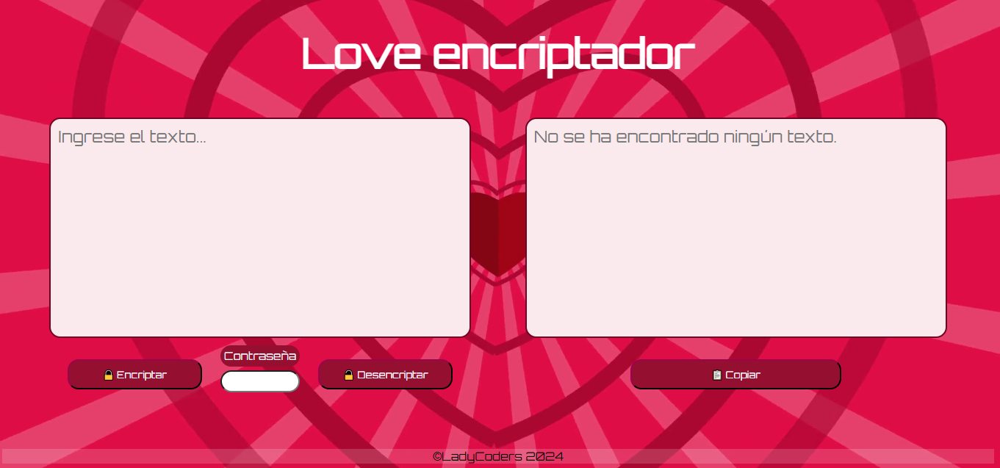

# 
🔏 Love Encriptador 

 

   

## 
 📃 Resumen 

#### Este proyecto tiene como objetivo crear una página web que permita a los usuarios cifrar y descifrar texto. El propósito principal es ofrecer un método de comunicación novedoso, especialmente diseñado para personas que desean expresar sus sentimientos de manera cifrada. Esta herramienta puede ser útil para enviar mensajes encriptados de forma segura, agregando un toque de misterio y diversión a la comunicación.

   

## 
 📋 Funcionalidades 

* Cifrado de Texto: Los usuarios pueden ingresar un texto en la página web, seleccionar un desplazamiento (en el caso de un cifrado César) y ver el texto transformado en su forma cifrada. </li>
* Descifrado de Texto: De manera similar, los usuarios pueden ingresar un texto cifrado y descifrarlo utilizando el desplazamiento correcto para revelar el mensaje original.</li>

   

## 
 🚀 Despliegue 

#### Puedes ver el proyecto desplegado en este [enlace](https://mishell-a.github.io/proyecto_II/).

   

## 
 🔨  Stack 

####   

 